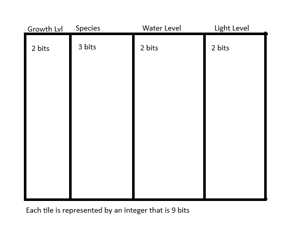

# Converted Repo for CMPM121 Final Project

## Devlog Entry = [12/2/2024]

## Reflection
This was also an incredibly quick turn around for the requirements. Especially around the holidays, our group went home to see family and celebrate Thanksgiving. Thanks to everyone's hard work, we were able to crank out a majority of the requirements Saturday and Sunday, allowing for better adjustment of bugs. The group the night before stayed up late making sure the external DSL was working correctly for the world presets. Everyone had again taken on different roles to fill whatever was needed to get done. So, this shuffled the roles of each person again for these software requirements.

## How we satisfied the software requirements
- [x] [F2.a] External DSL for scenario designs: In separate text file or text block, designers should be able to express the design of different gameplay scenarios, e.g. starting conditions, weather randomization policy, and victory conditions.
    - James, Jack, Rozy, and Jackson developed inside of the parseDSL file a JSON-type reading function that parses the file being fed into the game in order to determine the win condititions, weather/ event times, etc. This instantiates the game with the pre-read world presets for the game.
- [x] [F2.b] Internal DSL for plant types and growth conditions: Within the main programming language used for the rest of your game, you should implement and use a domain-specific language for defining your different types of plants and the unique growth rules that apply to each.
    - With our switch over to Typescript, James developed a plant array in our plant manager. Each plant object includes their sun, water and weather conditions in order for them to grow. Inside the PlantManager file there are three different types of flowers being parsed internally, which then map to our game. Once added to the array a new plant type can be added to the game by calling the add plant function with the new plant type's number.
- [x] [F2.c] Switch to an alternate platform: Change either your project's primary programming language or your primary user interface library/engine/framework.
    - James, Jack, and a little bit of Phoebe's work, we changed our primary language to TypeScript instead of our previous JavaScript. We took all day ensuring that the TypeScript conversion still allowed all of our features to be implemented correctly.

### F0+F1
- No major changes made to the F0 and F1 requirements.

### External DSL for Scenario Design
Our design for our external DSL parsing for world presets is based off of the JSON data language. We decided this would be best since JSON is easy to parse in Typescript and would give us a straight forward way of passing in the different world presets into our game. 

``` File
rules:
weather-random: true
winning-plant-num: 6
winning-plant-growth: 3
end-rules
day 1:
weather: sunny
end-day
day 2:
weather: rainy
end-day
end-file
```

``` TypeScript
for (const line of lines) {
        if (line != '') {
            const words = line.split(' ')
            switch (words[0]) {
                case 'rules:':
                    console.log('STARTING RULES SECTION:')
                    break
                case 'weather-random:':
                    console.log(`WEATHER RANDOM?: ${words[1]}`)
                    // COMMAND FOR RANDOM OR SET WEATHER
                    worldPresets.weatherRandom = words[1] == 'true' ? true : false
                    break
                case 'winning-plant-num:':
                    console.log(`NUMBER OF WINNING PLANTS TO BEAT GAME: ${words[1]}`)
                    worldPresets.winningPlantNum = Number(words[1])
                    // COMMAND TO CHANGE WIN CONDITION
                    break
                case 'winning-plant-growth:':
                    console.log(`WINNING PLANT GROWTH LEVEL: ${words[1]}`)
                    worldPresets.winningPlantGrowth = Number(words[1])
                    // COMMAND TO CHANGE WIN CONDITION
                    break
                case 'day':
                    console.log('NEW DAY')
                    // "(1):"
                    // date = [1,:]
                    date = words[1].split(':')
                    console.log(`DAY IS: ${date[0]}`)
                    day = Number(date[0])
                    break
                case 'weather:':
                    console.log(`SETTING WEATHER ON DAY ${day}`)
                    weather = words[1]
                    console.log(`WEATHER SET TO: ${weather}`)
                    worldPresets.days[day] = weather
                    break
                case 'end-day':
                    console.log(`RUNNING COMMAND TO SET DAY ${day}'S WEATHER TO ${weather}`)
                    break
                case 'end-rules':
                    console.log('RULES DONE')
                    break
                case 'end-file':
                    break
                default:
                    console.error('Bad formatting of the .dsl file.')
            }
        }
    }

    return worldPresets
```
This reads in the the string and parses the different world presets assigned in said string. Our parser than assigns the different world attributes which then returns the presets which we can then use in order to pre determine the game. 

### Internal DSL for Plants and Growth Conditions
Our internal DSL for plants inside of our PlantManager.ts file also follows a similar JSON-esk style of determining the different plants and their conditions. From the external DSL we can parse what was assigned and then update the database of flowers in our internal accordingly. 

### Switch to Alternate Platform
James and Jack waded through all the Javascript files from the previous repo and converted all the Javascript to Typescript. Thankfully, the switch from JS to TS was incredibly straight forward and smooth, as our game was able to retain functionality from the change. We decided with the quick turn around for most of the projects requirements, the change from Javascript to Typescript would be more straight forward with less intended bugs. 

## Devlog Entry = [11/26/2024]

### F1 Reflection

For this week, Jack, James, and Rozy all came through and revamped the byte array. Our team's plan changed since we had very little turn around time to try and get this section of our final project finished in time for the Thanksgiving Holiday. Thankfully, Jack, James and Rozy pulled through and were able to develop a byte array shown below. We definitely changed up the roles this time around for this part of the implementation since people were either unavailable or working on other class projects. Jackson became more of our tools guy and Phoebe ended up working on more of the design for the README. Our game design evolved more into making sure that the player can have more agency over their choices. This allows the player to be able to have their choices matter, and undo actions based on players' wishes.

### How we satisfied the software requirements

- [x] [F0] Same as last week.
- [x] [F1.a] The important state of your game's grid must be backed by a single contiguous byte array in AoS or SoA format. If your game stores the grid state in multiple format, the byte array format must be the primary format (i.e. other formats are decoded from it as needed).
    - Each integer represents a tile in the world, so we ended up using an array of structures: 
- [x] [F1.b] The player must be able to manually save their progress in the game. This must allow them to load state and continue play another day (i.e. after quitting the game app). The player must be able to manage multiple save files/slots.
    - Implemented a Menu scene in phaser, allowing the player to load and create saves. Using local storage players can load their save based on the save name, this passes all the need information to the play scene.
- [x] [F1.c] The game must implement an implicit auto-save system to support recovery from unexpected quits. (For example, when the game is launched, if an auto-save entry is present, the game might ask the player "do you want to continue where you left off?" The auto-save entry might or might not be visible among the list of manual save entries available for the player to load as part of F1.b.)
    - Implemented a savePrompt function that allows for automatic creation of a save file for the player. The save file is connected to a randomized string of numbers that can be used for the information passed to the play scene.
    - The game also "auto-saves" the entire state of the game whenever the player ticks time forward during gameplay.
- [x] [F1.d] The player must be able to undo every major choice (all the way back to the start of play), even from a saved game. They should be able to redo (undo of undo operations) multiple times.
    - Implemented multiple arrays to keep track of the player's undone and former states, as well as their current state in the GameManager file. These states are stored as arrays of objects called WorldStates and are named formerStates and undoneStates and currentAction is stored as a single WorldState which keeps track of the player's present state. When the player wants to undo or redo an action, the WorldState function undo() or redo() will be called on the currentAction WorldState.

## Devlog Entry = [11/22/2024]

### F0 Reflection

Our team's plan was to divide and conquer the different software requirements. We each split up the different requirements and started parallel programming with each other for several hours. We all contributed an equal amount to make sure that we all had an equal share to the project itself. We honestly didn't reconsider our roles that we originally decided on because we all jumped into the roles that someone else needed, so our roles ended up existing as delagated responsibilities rather than restrictive jobs for each person. As we all worked on different software requirements, when some people on the team finished, they then helped those with requirements that were giving them trouble. Our outlook changed from simply dividing the work up by part, to using that notion as an initial goal for each person, and grouping up as needed to finish the whole project. Helping each other in each aspect of the software requirements allowed us to understand each aspect of the project. Finally we all sat together and merged all our aspects from our branches to make sure it all meshed and worked together well and tied logic from our various requirements together. Being that each person had looked at all the other team member's code, it was easier for us to tie together all of our hard work at the end.

## Devlog Entry = [11/21/2024]

We all got together to work on discord to complete F0 requirments, keeping in mind the released F1 requirements. Liveshare, Github Desktop, and Discord Whiteboard were the tools most immediately relevent to our progress. We had already set up the framework for most of the things we finished on the 21st when we worked in person, and we made sure to have individual branches we could use to fiddle in the meantime, so completing the F0 requirements went smoothly. In addition to finishing those, we chose to integrate Prettier into our repository and will be using that as our code formatter for the forseable remainder of the project.

### How we satisfied the software requirements

- [x] [F0.a] You control a character moving over a 2D grid.
    - The player moves by occupying the tile space the cursor pressed indicates they should occupy.
- [x] [F0.b] You advance time manually in the turn-based simulation.
    - The button at the top of the tile world increments time by an hour at a time.
- [x] [F0.c] You can reap or sow plants on grid cells only when you are near them.
    - Players can sow plants onto the tile they are standing on by pressing the 'E' key. Players can reap plants that they are standing on by pressing the 'SPACE' key.
- [x] [F0.d] Grid cells have sun and water levels. The incoming sun and water for each cell is somehow randomly generated each turn. Sun energy cannot be stored in a cell (it is used immediately or lost) while water moisture can be slowly accumulated over several turns.
    - Plants have water_req and sun_req to correspond to their given tile's changing water and sun levels, which are generated by a random weather event function, rewriting the sun level and adding to the water level.
- [x] [F0.e] Each plant on the grid has a distinct type (e.g. one of 3 species) and a growth level (e.g. “level 1”, “level 2”, “level 3”).
    - Plants have the species and growth level attributes to govern their creation and upgrades.
- [x] [F0.f] Simple spatial rules govern plant growth based on sun, water, and nearby plants (growth is unlocked by satisfying conditions).
    - Each plant has a grow function and growth rules that are passed in as parameters when constructed. When time is advanced, the plant checks the sun and water levels for its given tile, as well as the number of adjacent plants in the tiles around it. If those levels satisfy the growth requirements, the plant increases in growth level, and consumes the relevant resources from the tile.
- [x] [F0.g] A play scenario is completed when some condition is satisfied (e.g. at least X plants at growth level Y or above).
    - When players have at least 3 plants above growth level 3, the play scenario has been completed, and a console log statement saying 'GAME WON' will be outputted.

## Devlog Entry = [11/17/2024]

We went to James's house to work together on setting up defaults and initial tile-based movement. We used Live Share to make our collaboration smooth. In the future, we will be using individual branches, but for the initial tile-movement setup, we decided that group programming was best, since the grid would be the basis of the rest of the project.

### How we satisfied the software requirements

- [x] [F0.a] You control a character moving over a 2D grid.
    - The player moves by occupying the tile space the cursor pressed indicates they should occupy.

## Devlog Entry - [11/12/2024]

### Initial Setup

Our group rented out a study room in the Science and Engineering library to come up with the plan for how we will implement our final project and also how to put together this DevLog.

### Introducing the team

Rozy Dixon - Tools\
Phoebe Royer - Design/Engine\
Jackson Mclane - Engine\
Jack Sims - Tools/Design\
James Milestone - Engine/Tools

### Tools and materials

1.  The library we're using is Phaser. Since as a group we have more experience working with the phaser library from CMPM120. We also have some projects we had gotten inspired by to adapt to our final project. Because we have all taken CMPM120 and have used Phaser to prototype in other classes (CMPM179 and CMPM170), we think that there will be less friction with Phaser as the engine we're using.
2.  We will be transferring from Javascript to TypeScript in Phaser, we believe that it has better interchangability and as a team we understand the syntax better. We also believe using Phaser will better achieve the project we wish to create, so the most experience we have is Javascript, and now through this class now TypeScript. We chose to go from Javascript to Typescript because it will serve as motivation for keeping our Javascript code organized and typed strictly, in order to make the transition easy.
3.  We will be using: Github for version control, VSCode for our IDEs, Prettier as our styling tool, ESLint as a linter, LiveServer for testing before deployments, ChatGPT and Brace for debugging and style critique, the Live Share extension on VS Code to collaborate on the same files simultaneously, Discord Whiteboard for brainstorming and mind mapping, and Aesprite for our 2D art, if sound is needed Jack is going to use his synthesizer to create the sounds and the program Audacity to record and edit the sounds.
4.  We're going to be switching our language from JavaScript to TypeScript for our alternate platform. We figured this would be a quick swap, since its pretty much the same language, but it includes type casting. It should be pretty easy to swap to type script if we use Brace!

### Outlook

- We are hoping to create something publishable, and eventually host our project on itch.io.
- The hardest or riskiest part of the project is the impending shift from JavaScript to TypeScript.
- We are hoping to learn how to each specialize within respective responsibilities so that we can provide the greatest benefit to our team based on the roles we chose.

